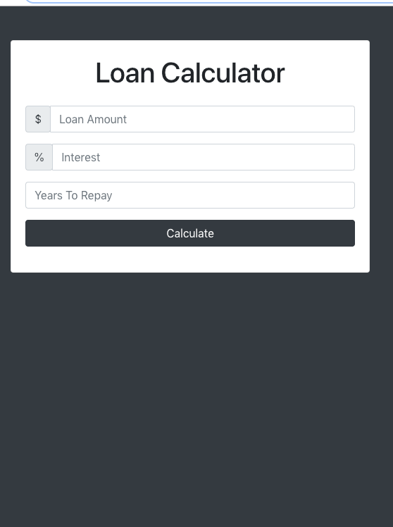

# Loan calculator

A loan calculator website that from the parameters loan amount, interest rate and numbers of years wanted for the repay calculates the monthly payment, total payment and total interest.

A loading image is used to simulate the ongoing calculation.

If there are errors there will be an error message.

Bootstrap is used for styling.

## A screenshot

On desktop

## Author
* Albert Stjärne (https://github.com/AlbertStjarne)